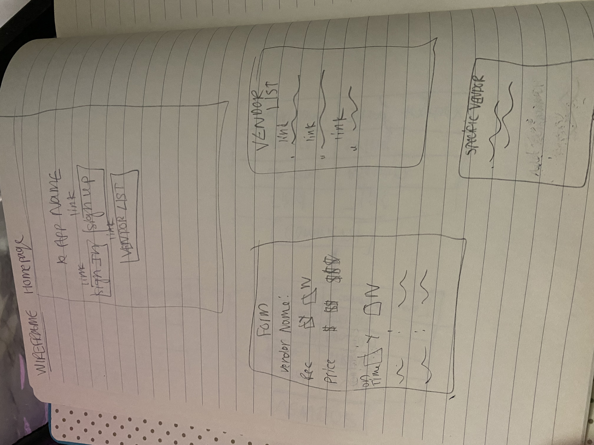

# Vendor-Review

*** VendorTea ***

VendorTea is an app where you can track down party related vendors that a person has utilized and their experience with them. They can also see what other vendors other users have reviewed. 

## Getting Started

link:

### CRUD ROUTES

INDEX: /users/userId/vendors GET

NEW: /users/:userId/vendors/new GET

Create: /users/:userId/vendors POST

SHOW: /users/:userId/vendors/:vendorId GET

EDIT: / users/:userId/vendors/:vendorId/edit GET

UPDATE: /users/:userId/vendors/:vendorId PUT

DELETE: /users/:userId/vendors/:vendorId Delete

## Attributions

Some of the websites I utilized to help with coding include:

* [MDN](https://developer.mozilla.org/en-US/)

* [Chatgpt](https://chatgpt.com/)

* [Htmlcolorcodes](https://htmlcolorcodes.com/color-names/)

## Technologies Used

* Javascript
* CSS
* MongoDB
* ejs

# Next Steps

Strech goals: For my stretch goals I would make it so other users can add comments to already reviewed companies. I would also add a star rating for users to click on. 

